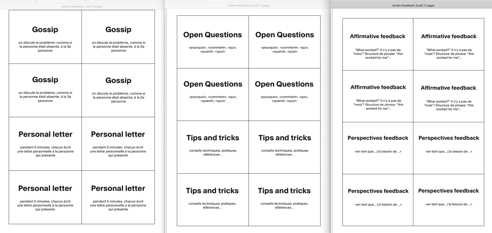
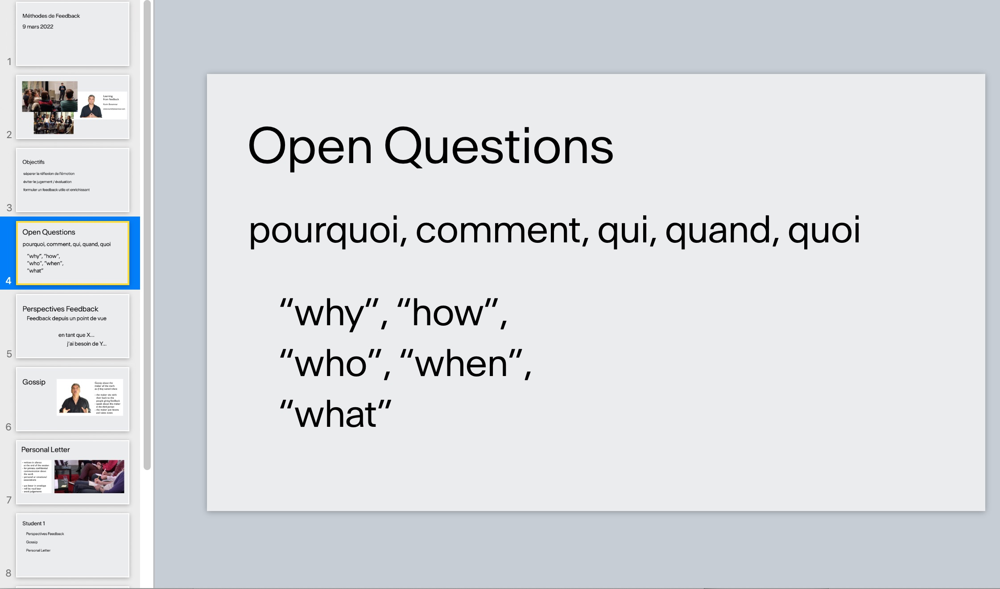

## Trucs à télécharger

### Cartes à découper

Des pages A4 avec des "cartes à découper" qui contiennent un court descriptif des formats.

[Télécharger (PDF et modèle InDeisgn)](ressources/Cartes-Feedback.zip)

Cela est utile pour:

- Quand on prépare une session, en discussion avec la personne qui va présenter: permet de choisir les formats et de déterminer leur ordre.
- Pendant une session, peut aider des participants qui "débutent" à se souvenir des formats.

### Un Keynote d'introduction

Un document Keynote pour introduire les formats de feedback

[Télécharger le fichier Keynote](ressources/Feedback-Slides-Intro.zip)